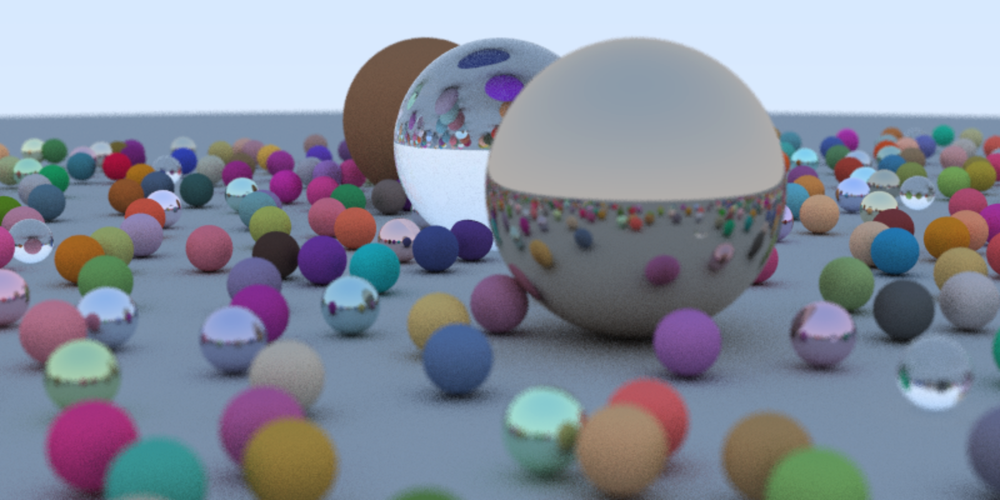

A few years ago, as I was reading Peter Shirley's excellent book "Ray Tracing in One Weekend", I implemented the ray tracers for each chapter in JavaScript. Although JavaScript is notoriously slower than C++, especially for cpu-intensive tasks such as ray-tracing, it has the advantage of being tightly integrated with web browsers. So, instead of generating a file to be opened by an image viewer, you can use a bit of HTML and draw directly on the canvas, providing (almost) instant gratification. Besides, it provided a good opportunity for me to learn a bit of JavaScript.

This repository contains an updated version of those ray tracers, slightly modernized for ES6. I'm planning to follow up with implementations for his later books ("Ray Tracing: The Next Week" and "Ray Tracing: The Rest of Your Life"), which I have not read yet.

The most used data structure in a ray tracer is a vector with 3 (sometimes 4) floating-point numbers. Although I've seen JaveScript code that mimics C++ and creates a Vector3 class with constructors and methods, I've realized that this generalization causes considerable overhead. My approach was to use simple lists of numbers to represent vectors, e.g. `[x, y, z]`, and have simple functions instead of methods to operate on them. For example, the sum of two vetors and their dot product is simply

    function dotVec(u,v) { return u[0]*v[0] + u[1]*v[1] + u[2]*v[2]; }
    function addVec(u,v) { return [u[0]+v[0], u[1]+v[1], u[2]+v[2]]; }

Later I learned about [typed arrays](https://developer.mozilla.org/en-US/docs/Web/JavaScript/Typed_arrays) and I may experiment with them at some point. On one hand it seems this should be faster than the non-typed generic lists because the runtime knows the array's size and type, but on the other hand it looks like it will incur some overhead when calling constructors for ArrayBuffer and Float64Array. Besides, using Float32Array, 4 bytes per element instead of 8, might provide some improvement. We'll see.

Finally, I'd like to note that the chapter numbers used to name the files in this repo refer to the original Kindle version. Since that first edition the book has been edited, the chapters have been rearranged, the C++ code has been modernized and it is now available [here](https://raytracing.github.io/books/RayTracingInOneWeekend.html). So I will probably update my code to refer to the new edition, but for now be advised that it refers to the first edition.

